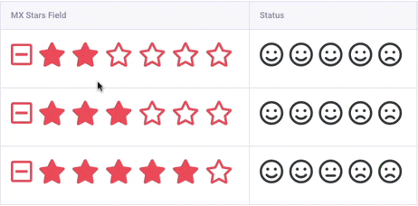

# MX Stars Field

**MX Stars Field** An easy to use and highly flexible ratings field for ExpressionEngine.

## Compatibility
* Multi Site Manager
* Channel Form
* Grid
* Fluid

### ExpressionEngine
* ExpressionEngine 5
* ExpressionEngine 6

## Installation
* Place the **mx_stars_field** folder inside your **user/addons** folder
* Go to **cp/addons** and install *MX Stars Field*

## Template Tags

	{field_name}

## ToDo
* Config override
	* Font Awesome Link
* Extended view for Entry Manager
* Preview on Settings page
* Extended settings 
	
## Support Policy
This is Communite Edition  add-on.

## Contributing To MX Stars Field for ExpressionEngine

Your participation to MX Stars Field development is very welcome!

You may participate in the following ways:

* [Report issues](https://github.com/MaxLazar/mx-stars-field/issues)
* Fix issues, develop features, write/polish documentation
Before you start, please adopt an existing issue (labelled with "ready for adoption") or start a new one to avoid duplicated efforts.
Please submit a merge request after you finish development.

## License

The MX Stars Field is open-sourced software licensed under the [MIT license](http://opensource.org/licenses/MIT)
